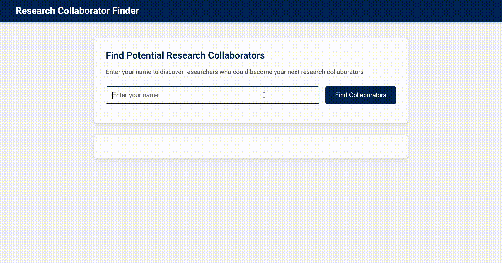

# Co-Author Recommendation System

A graph-based recommendation system for identifying potential co-authors, built using arXiv metadata and Graph Neural Networks.



---

## Project Overview 🔍

This project builds a dynamic **co-authorship graph** to suggest research collaborations:
- **Nodes** represent authors
- **Edges** represent past co-authorships
- **Node features** are generated from **SciBERT** embeddings of paper titles

Using a **GraphSAGE** model, we perform **link prediction** to identify likely new collaborations based on graph structure and content features.

---

## Features

- Preprocessing of arXiv Computer Science papers (Nov 2024 – May 2025)
- Filtering unrealistic nodes (authors with >500 papers, papers with >20 authors)
- Title embeddings using `allenai/scibert_scivocab_uncased`
- PyTorch Geometric graph construction
- Temporal data splits: train / val / test based on update date
- Negative sampling for supervised link prediction
- Dockerized web interface for testing recommendations

---

## Results 📈

| Metric     | Score  |
|------------|--------|
| ROC-AUC    | 0.6945 |
| MRR@10     | 0.2602 |

These results show meaningful predictive performance on future co-authorships.

---

## How to Run 🚀

1. Clone the repo:
```bash
git clone https://github.com/liaaana/DataMining-CoathorsRecommendationGraphSAGE.git
cd DataMining-CoathorsRecommendationGraphSAGE
```

2. Build and run with Docker:
```bash
docker-compose up --build
```

3. Open in browser:
```
http://127.0.0.1:5000
```

Enter an author name from the dataset to get suggestions.

---

## Team

Rufina Gafiiatullina  
Arina Goncharova  
Liana Mardanova  
Anastasiia Shvets  
Sofia Tkachenko
